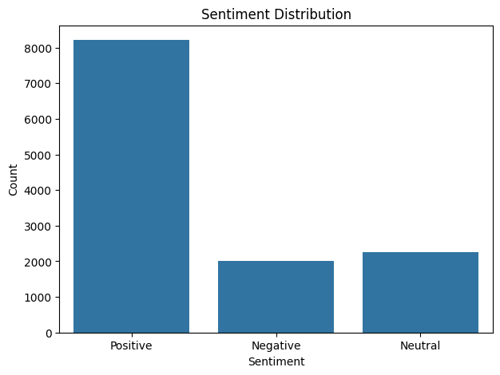
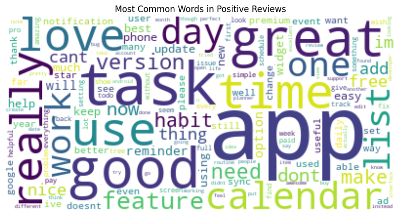
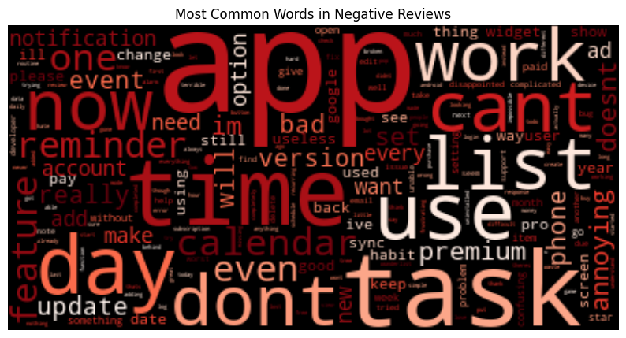

# 📊 Play-Store Reviews Sentiment Analysis  
*Understanding why users love or hate your app — beyond just star ratings.*

  
  
  

---

## 🚀 Project Overview  
This project performs **sentiment analysis** on Google Play Store reviews to uncover actionable insights.  
Instead of only looking at ratings, we analyze the text of reviews to see *what users actually feel* and *why*.  

---

## 🎯 Key Features  
- ✅ **Data Cleaning** – preprocess raw reviews (drop irrelevant columns, lowercase, punctuation removal).  
- ✅ **Sentiment Analysis** – classify reviews into *Positive*, *Negative*, or *Neutral* using **TextBlob**.  
- ✅ **Visual Insights** –  
  - Sentiment distribution bar chart  
  - Word clouds for positive & negative reviews  
- ✅ **Business Insights** – strengths & weaknesses derived directly from user feedback.  

---

## 🛠️ Tech Stack  
- **Python 3.10+**  
- **Pandas & NumPy** – data handling  
- **TextBlob** – NLP sentiment analysis  
- **Matplotlib & Seaborn** – visualization  
- **WordCloud** – word frequency visualization  
- **Jupyter Notebook** – interactive exploration  

---

## 📂 Project Structure  

```
Play-store-reviews/
│
├── data/                      
│
├── notebooks/                  
│   └── sentiment_analysis.ipynb
│
├── images/                     
│   ├── sentiment_distribution.png
│   ├── positive_wordcloud.png
│   └── negative_wordcloud.png
│
├── requirements.txt           
├── README.md                  
└── LICENSE
```                 
⚙️ Setup & Usage
Clone the repository:

```
git clone https://github.com/hackbuddy1/Play-store-reviews.git
cd Play-store-reviews
```
Create and activate a virtual environment:

```
python -m venv .venv

# On Windows
.venv\Scripts\activate

# On macOS/Linux
source .venv/bin/activate
```
Install dependencies:

```
pip install -r requirements.txt
```
Run the notebook:

```
jupyter notebook
```

📊 Example Visualizations
### Sentiment Distribution
  
### Positive Word Cloud

### Negative Word Cloud
  

🔍 Insights & Recommendations
1. Overall Sentiment → ~70% reviews are Positive → strong product-market fit.

2. Key Strength → Simplicity and ease of use dominate positive reviews.

3. Critical Weakness → Users complain about crashes and slow performance.

💡 Action Plan:

- Fix technical stability issues → reduces negative reviews.

- Highlight simplicity in marketing strategy.

- Continuously monitor reviews to track improvements.

🚀 Future Improvements
- Use advanced NLP models like VADER or BERT for better accuracy.

- Automate scraping & analysis pipeline.

- Build an interactive dashboard for live sentiment tracking.

- Deploy as a web app (Flask/Streamlit).

🤝 Contributing
Contributions are welcome!

Steps:

1. Fork the repo
2. Create a feature branch
3. Commit changes
4. Submit a PR 🎉

📜 License
This project is licensed under the MIT License.
